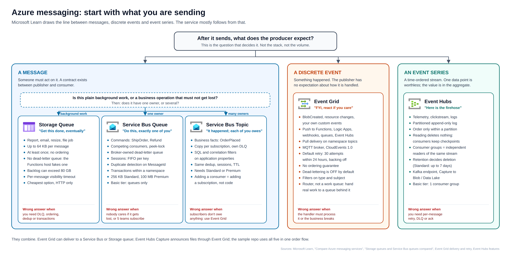
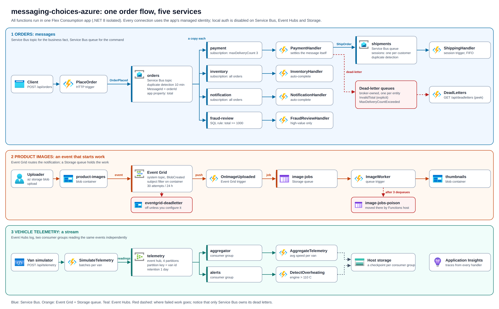

# messaging-choices-azure

One e-commerce order flow that uses all five Azure messaging options, each for the job it was built for:

| Payload | Service | In this sample |
|---|---|---|
| Message, many owners | **Service Bus topic** | `OrderPlaced` → payment, inventory, notification, fraud-review (SQL filter) |
| Message, one owner | **Service Bus queue** | `ShipOrder` command, sessions per customer, duplicate detection |
| Discrete event | **Event Grid** | `BlobCreated` on `product-images` → `OnImageUploaded` |
| Background work | **Storage queue** | `image-jobs` → `ImageWorker`, poison queue after 3 dequeues |
| Event series | **Event Hubs** | van telemetry, 4 partitions, two consumer groups |





## What's in the box

```
azure.yaml                         azd service + postdeploy hook
infra/
  main.bicep                       subscription scope: resource group + outputs
  resources.bicep                  Service Bus, Event Hubs, Event Grid system topic, 2 storage accounts,
                                   Flex Consumption function app, App Insights, RBAC (no keys anywhere)
  eventgrid-subscription.bicep     BlobCreated -> OnImageUploaded webhook, retry policy, dead-letter
scripts/
  postdeploy.ps1                   creates the Event Grid subscription after the code exists
  demo.ps1                         drives every scenario, then peeks the dead letters
src/OrderFlow/                     .NET 8 isolated Azure Functions
  Orders/PlaceOrder.cs             POST /api/orders -> Service Bus topic
  Orders/OrderSubscribers.cs       4 subscription handlers; payment settles and dead-letters itself
  Orders/ShippingHandler.cs        session-enabled queue trigger
  Orders/DeadLetters.cs            GET /api/deadletters (peek only)
  Images/ImagePipeline.cs          Event Grid trigger -> Storage queue -> worker
  Telemetry/TelemetryStream.cs     POST /api/telemetry -> Event Hubs -> 2 consumer groups
images/                            diagrams (SVG + PNG), drawn with the official Azure icons
```

## Deploy

Prerequisites: .NET 8 SDK, Azure Functions Core Tools v4, `azd` 1.18.2 or later (older versions need PowerShell 7 for the `pwsh` hook, newer ones fall back to Windows PowerShell 5.1), `az` (logged in). No Docker needed.

```powershell
azd auth login
azd env new messaging-choices
azd env set AZURE_LOCATION swedencentral
azd up
```

`azd up` provisions, deploys the function app, then runs `scripts/postdeploy.ps1`. That hook waits for the host's `eventgrid_extension` key and deploys `infra/eventgrid-subscription.bicep`. It has to run after deploy: an Event Grid webhook subscription validates its endpoint on creation, and the endpoint only exists once the code is there. The hook also removes the default match-all rule from `fraud-review`, so that subscription really only receives orders of 1,000 or more. If the hook fails, rerun it with `azd hooks run postdeploy`.

Your own user (`AZURE_PRINCIPAL_ID`, set by azd) gets Blob and Queue Data Contributor on the work storage account and Data Owner on Service Bus and Event Hubs, so the demo and a local `func start` work with `az login` (copy `src/OrderFlow/local.settings.sample.json` to `local.settings.json` and fill in the names from `azd env get-values`; the Event Grid trigger only fires in Azure). Role assignments can take a minute or two to propagate.

## Run the demo

```powershell
./scripts/demo.ps1
```

Windows PowerShell 5.1 and pwsh 7 both work. The script sends:

1. a normal order → payment, inventory, notification each log it once
2. **the same order again** → dropped by topic duplicate detection, handlers do not run twice
3. a 1,499.00 order → also reaches `fraud-review` through the SQL rule
4. a zero-total order → payment dead-letters it explicitly with reason `InvalidTotal`
5. a `poison` customer → payment throws, broker dead-letters after 3 deliveries (`MaxDeliveryCountExceeded`)
6. two blob uploads → Event Grid → Storage queue; `corrupt-*.png` ends in `image-jobs-poison`
7. a telemetry burst → `AggregateTelemetry` and `DetectOverheating` both read every event

Then it calls `GET /api/deadletters` and prints a KQL query for Application Insights. Every handler logs with a prefix (`ORDER`, `PAYMENT`, `SHIPPING`, `EVENTGRID`, `IMAGE-WORKER`, `STREAM-AGGREGATE`, `STREAM-ALERT`, ...), so the trace view reads like the flow diagram.

### Call it yourself

```powershell
$base = (azd env get-value FUNCTION_BASE_URL)
$key  = az functionapp keys list -g (azd env get-value AZURE_RESOURCE_GROUP) -n (azd env get-value AZURE_FUNCTION_APP_NAME) --query functionKeys.default -o tsv

Invoke-RestMethod -Method Post "$base/orders?code=$key" -ContentType 'application/json' -Body '{"customerId":"cust-9","lines":[{"sku":"MUG-01","quantity":1,"unitPrice":12.5}]}'
Invoke-RestMethod -Method Post "$base/telemetry?vehicles=3&readings=100&code=$key"
Invoke-RestMethod "$base/deadletters?code=$key" | ConvertTo-Json -Depth 6
```

## Design notes

- **Managed identity only.** `disableLocalAuth` on Service Bus and Event Hubs, `allowSharedKeyAccess: false` on both storage accounts. Triggers use `<Connection>__fullyQualifiedNamespace` / `__queueServiceUri` settings. The Event Grid dead-letter destination uses the system topic's identity for the same reason.
- **Send side uses SDK clients, not output bindings.** Duplicate detection needs `MessageId`, ordering needs `SessionId`, subscription rules need application properties, and Event Hubs needs a partition key. Output bindings don't expose all of that.
- **Send + complete is not atomic.** `PaymentHandler` sends `ShipOrder` and then completes the incoming message. A crash in between means a resend, and duplicate detection on `shipments` (`MessageId = {orderId}:ship`) absorbs it.
- **Watch the `$Default` rule.** Service Bus gives every new subscription a `$Default` TrueFilter, and a subscription's rules are OR-ed together. So `fraud-review` with its SQL rule alongside `$Default` would still match every order, with no error. On the first deployment, a `$Default` rule redeclared in Bicep came back from `az` without the SQL filter, so we couldn't count on that override. so the SQL rule is named `high-value` and the postdeploy hook deletes every other rule on the subscription.
- **Tiers are deliberate.** Service Bus Standard (Basic has no topics, sessions or duplicate detection). Event Hubs Standard (Basic allows only the `$Default` consumer group).

## Cost and clean-up

Event Hubs Standard bills per throughput unit hour, and Service Bus Standard has a monthly base charge, whether you send traffic or not. Flex Consumption, Storage and Event Grid are pay per use. Tear it down when you're done:

```powershell
azd down --purge
```

## Status

Deployed with `azd up` to Sweden Central (September 2026). The build, provisioning, code deployment and postdeploy hook (Event Grid subscription and the `fraud-review` rule clean-up) all succeed. `bicep build` passes, with one known BCP334 warning on the storage account name. The end-to-end demo results are still to be added.

If `azd up` fails with *"The 'location' property must be specified"*, `AZURE_LOCATION` isn't set in the azd environment: run `azd env set AZURE_LOCATION swedencentral`. In that case azd may also report *"package output ... is empty"*. That error is a side effect: packaging runs alongside provisioning and gets cancelled when provisioning fails.

## License

MIT
